# SUIMON: Command Line Tool for Monitoring SUI Network

<div style="text-align:center;">
  
<p align="center">
  <a href="https://github.com/bartosian/suimon/releases/latest">
    
  </a>
  <a href="https://goreportcard.com/report/github.com/bartosian/suimon">
    
  </a>
</p>
</div>

`Suimon` is a powerful command line tool designed to provide detailed dashboards for monitoring the SUI network. With Suimon, you can easily monitor your nodes' and validators' health and performance and track important system states and events in real time.

Whether you're a network operator, validator, or simply a curious observer, Suimon offers a range of powerful monitoring capabilities that can help you stay on top of the SUI network. From node status and uptime monitoring to detailed performance metrics and system state tracking, Suimon provides everything you need to ensure your network runs smoothly and efficiently.

So if you're looking for a powerful, reliable tool for monitoring the SUI network, look no further than Suimon. Try it out today and start monitoring your network with confidence!

## Table of Contents

- [SUIMON: Command Line Tool for Monitoring SUI Network](#suimon-command-line-tool-for-monitoring-sui-network)
  - [Installation](#installation)
    - [Ubuntu](#ubuntu)
    - [MacOS](#macos)
    - [Windows](#windows)
  - [Build and Installation from Source](#build-and-installation-from-source)
  - [Suimon Configuration Files](#suimon-configuration-files)
    - [Example Suimon Config Directory](#example-suimon-config-directory)
    - [Suimon Configuration Fields](#suimon-configuration-fields)
  - [Suimon Commands](#suimon-commands)
  - [Tables](#tables)
    - [Table Examples](#table-examples)
  - [Dashboards](#dashboards)
    - [Dashboard Examples](#dashboard-examples)
  - [License](#license)
- [Acknowledgments](#acknowledgments)

## Installation

There are installation scripts for several common environments, including Ubuntu, Mac OS, and Windows. These scripts are provided for convenience only and do not guarantee that Suimon will run without issues on your system.

### Ubuntu

```shell
wget -O $HOME/suimon_install.sh https://raw.githubusercontent.com/bartosian/suimon/main/scripts/ubuntu/install.sh && \
chmod +x $HOME/suimon_install.sh && \
$HOME/suimon_install.sh && \
rm $HOME/suimon_install.sh
```

### MacOS

```shell
curl -o $HOME/suimon_install.sh https://raw.githubusercontent.com/bartosian/suimon/main/scripts/macos/install.sh && \
chmod +x $HOME/suimon_install.sh && \
$HOME/suimon_install.sh && \
rm $HOME/suimon_install.sh
```

### Windows

```shell
Invoke-WebRequest -OutFile $HOME\suimon_install.ps1 https://raw.githubusercontent.com/bartosian/suimon/main/scripts/windows/install.ps1 ; \
powershell -ExecutionPolicy Bypass -File $HOME\suimon_install.ps1 ; \
Remove-Item $HOME\suimon_install.ps1
```

## Build and Installation from Source

Building and installing from the source is useful if you want to customize the code or if there is no pre-built binary available for your platform. It can also be a good learning experience if you are interested in how Suimon works.

1. **Install Go**

   - The Suimon installation requires Go. If you don't already have Go installed, please visit [https://golang.org/dl](https://golang.org/dl) and [https://go.dev/doc/install](https://go.dev/doc/install) for instructions on how to download and install Go on your system. Download the binary release that is suitable for your system and follow the installation instructions.

2. **Clone the Suimon repository**

   - Clone the Suimon repository by running the following command in your terminal:
     ```
     cd $HOME && \
     git clone https://github.com/bartosian/suimon.git && \
     cd suimon
     ```

3. **Install packages and dependencies**

   - Install packages and dependencies required by the Suimon tool by running the following command:
     ```
     go get -u ./...
     ```

4. **Build the Suimon package**

   - Build the Suimon package by running the following command:
     ```
     go build -o suimon .
     ```

5. **Move the built binary to the executable PATH**
   - Move the `suimon` binary to a directory that's listed in your executable PATH to make it easy to run the Suimon tool from anywhere in your terminal. You can find the list of directories in your executable PATH by running the following command in your terminal:
     ```
     echo $PATH
     ```
   - For example, if the output of the `echo $PATH` command includes `/usr/local/bin`, you can move the `suimon` binary to this directory by running the following command:
     ```
     mv suimon /usr/local/bin/
     ```
   - If you're not sure which directory to use, you can create a new directory in your home directory called `bin` by running the following command:
     ```
     mkdir $HOME/bin
     ```
     Then, add the `bin` directory to your executable PATH by adding the following line to your shell configuration file (e.g. `~/.bashrc` for Bash or `~/.zshrc` for Zsh):
     ```
     export PATH=$PATH:$HOME/bin
     ```
     Finally, move the `suimon` binary to the `bin` directory by running the following command:
     ```
     mv suimon $HOME/bin/
     ```
6. **Create a Suimon config directory and put the config file there**

   - Create a directory for your Suimon config files by running the following command:

     ```
     mkdir $HOME/.suimon && \
     cp $HOME/suimon/main/static/templates/suimon-testnet.yaml $HOME/.suimon/suimon-testnet.yaml
     ```

     The 'suimon-testnet.yaml' file that you have just copied is a template file and must be customized with your specific environment data before running the Suimon tool.

   - For each network that you want to connect to, create a separate YAML file with the naming convention `suimon-<network>.yaml` and put it in the `.suimon` directory. For example, if you want to connect to the mainnet, you can create a file called `suimon-mainnet.yaml` and put it in the `.suimon` directory.

## Installation using Homebrew

For macOS users, suimon can be seamlessly installed using the Homebrew package manager. Please adhere to the subsequent steps to facilitate the installation.

1. **Tap into the Repository**

   - To access the necessary formulae for the installation, you'll need to first tap into our repository:
     ```
     brew tap bartosian/tools
     ```

2. **Initiate the Installation**

   - With the repository tapped, proceed to install Suimon:
     ```
     brew install suimon
     ```

3. **Post-installation Configuration**

   - Following the installation, it's essential to set up the suimon configuration file. Detailed instructions for this setup are provided in the subsequent section of this document.
     Upon completion of these steps, suimon will be configured and ready for use on your macOS system.
  
## Suimon Configuration Files

`Suimon` uses configuration files to manage settings and defaults for different environments and networks. The default configuration file for the Suimon tool is `suimon-testnet.yaml`, which is located in the `~/.suimon` directory. However, you can use multiple configuration files to manage settings for different networks and environments.

By properly configuring your Suimon configuration file, you can reduce the need for command-line interface (CLI) flags when running the tool. The configuration file can contain default values and settings that are automatically applied to the tool when it is executed. This can streamline your workflow and reduce the amount of time and effort required to run the tool.

You can also provide a different location for the configuration files by using the `SUIMON_CONFIG_PATH` environment variable to the desired configuration directory path. This allows you to customize the location of the configuration files to your needs, such as if you want to store it in a specific directory or share it with others in a different location.

To manage settings for different networks and environments, create separate configuration files with the naming convention `suimon-<network>.yaml` and put them in the ~/.suimon directory. For example, if you want to connect to the mainnet, you can create a file called `suimon-mainnet.yaml` and put it in the `.suimon` directory.

### Example Suimon Config Directory

The names for these configuration files are up to the user. In this example, we've used the naming convention `suimon-<network>.yaml` to provide an example of how to name configuration files for different networks.

Here is an example file tree for the `~/.suimon` directory with separate configuration files for all sui networks:

```
~/.suimon
├── suimon-testnet.yaml
├── suimon-devnet.yaml
└── suimon-mainnet.yaml
```

### Suimon Configuration Fields

`Suimon` configuration files contain fields that allow you to customize the behavior of the tool to fit your specific use case. These files also enable you to add or remove monitored network entities and specify how they should be monitored. The suimon-testnet.yaml file, for instance, is a template configuration file that you can use as a starting point to create your own configuration file for testnet network. Before using Suimon, be sure to modify the configuration file with your own data and settings.

```yaml
# This SUI API endpoint exposes an extended set of functionalities beyond what is typically available in a standard public RPC.
# In addition to providing extended functionality, the public-extended-rpc API may also be required for some tables that rely on the methods provided by this API.
public-extended-rpc:
  - https://explorer-rpc.testnet.sui.io

# This section lists the public RPC endpoints that the client will use to monitor the network and calculate the health of the nodes and validators.
# Please make sure to provide at least one working endpoint.
public-rpc:
  - https://fullnode.testnet.sui.io:443
  - https://rpc-ws-testnet-w3.suiprovider.xyz:443
  - https://sui-api.rpc.com:443

# if you wish to monitor the nodes, update this section with the nodes information
full-nodes:
  - json-rpc-address: 0.0.0.0:9000
    metrics-address: 0.0.0.0:9184
  - json-rpc-address: https://sui-rpc.testnet.com
    metrics-address: https://sui-rpc.testnet.com/metrics

# if you wish to monitor the validators, update this section with the validators information
validators:
  - metrics-address: 0.0.0.0:9184/metrics
  - metrics-address: https://sui-validator.testnet.com:9184/metrics
  - metrics-address: https://sui-validator.testnet.com:9184/metrics

# provider and country information in tables is requested from https://ipinfo.io/ public API. To use it, you need to obtain an access token on the website,
# which is free and gives you 50k requests per month, which is sufficient for individual usage.
ip-lookup:
  access-token: 55f30ce0213aa7 # temporary access token with requests limit
```

1. **public-extended-rpc**

The `public-extended-rpc` section lists the public extended RPC endpoints that provide extended set of functionalities beyond what is typically available in a standard public RPC. The public-extended-rpc API may also be required for some tables that rely on the methods provided by this API.

```yaml
public-extended-rpc:
  - https://explorer-rpc.testnet.sui.io
```

These endpoints are managed by the SUI team, which you can use alongside your own to monitor the relevant networks.

| Network | RPC Endpoint                          |
| ------- |---------------------------------------|
| Devnet  | `https://explorer-rpc.devnet.sui.io`  |
| Testnet | `https://explorer-rpc.testnet.sui.io` |
| Mainnet | `https://explorer-rpc.mainnet.sui.io` |

2. **public-rpc**

The `public-rpc` section lists the public RPC endpoints that the client will use to monitor the network and calculate the health of the nodes and validators. Therefore, it is essential to provide accurate and up-to-date endpoint information in this section.
This field is required to request system metrics and to calculate the health of nodes and validators. The other fields are optional and can be updated if needed.

```yaml
public-rpc:
  - https://wave3-rpc.testnet.sui.io:443"
  - https://rpc-ws-testnet-w3.suiprovider.xyz:443
  - https://sui-api.rpc.com:443
```

These endpoints are managed by the SUI team, which you can use alongside your own to monitor the relevant networks.

| Network | RPC Endpoint                      |
| ------- | --------------------------------- |
| Devnet  | `https://fullnode.devnet.sui.io`  |
| Testnet | `https://fullnode.testnet.sui.io` |
| Mainnet | `https://fullnode.mainnet.sui.io` |

3. **full-nodes**

The `full-nodes` section lists the full nodes for monitoring in the SUI network. The user can update this section with information for any number of nodes, following the example format provided. It is important to note that the RPC address is required to be provided for each node, while the metrics address is optional.

```yaml
full-nodes:
  - json-rpc-address: 0.0.0.0:9000
    metrics-address: 0.0.0.0:9184
  - json-rpc-address: https://sui-rpc.testnet.com
    metrics-address: https://sui-rpc.testnet.com/metrics
```

4. **validators**

The `validators` section lists the validators to monitor. The user can update this section with information for any number of validators, following the example format provided. It is important to note that only the metrics endpoint is required to be provided for each validator.

```yaml
validators:
  - metrics-address: 0.0.0.0:9184/metrics
  - metrics-address: https://sui-validator.testnet.com:9184/metrics
  - metrics-address: https://sui-validator.mainnet.com:9184/metrics
```

5. **ip-lookup**

The `ip-lookup` section provides information on how to use the `ipinfo.io` public API to get provider and country information in tables. The user needs to obtain an access token on the website to use this feature. The current access token provided is temporary with a limited number of requests per month.

```yaml
ip-lookup:
  access-token: 55f30ce0213aa7 # temporary access token with requests limit
```

## Suimon Commands

The Suimon tool provides several commands that offer capabilities to monitor the SUI network and its entities. Here is an overview of the main commands:

- `suimon help`: provides detailed information about how to use any of the available Suimon commands, including a brief description of what each command does and the syntax for using it. This command can be used to quickly learn how to use any of the other Suimon commands, making it an essential tool for getting started with Suimon monitoring.
  <br><br>
  
  <br><br>

- `suimon monitor`: allows you to monitor the health of the running SUI network with the Suimon monitoring tool. This tool provides you with real-time updates on network statistics, including the number of nodes, validators, and their respective statuses. Additionally, the tool also provides you with insight into the health of the network, including any issues or errors that may be present. By running this command, you can ensure that the SUI network is running optimally and take corrective action in case of any issues.
  <br><br>
  When you run the command, the monitoring tool will start and display a list of available configurations that have been added to the `.suimon` directory. Each item in the list corresponds to a configuration file, and you can select the configuration you want to use following the instructions in the terminal.

  After selecting a configuration file to use with the suimon monitor command, you will be presented with another list of options to select the monitor type you want to use. There are two monitor types available: static and dynamic.

  The `static` monitor type displays tables that show detailed information about the network, such as block and transaction data, validator information, and network statistics. This type of monitor is useful for analyzing the network and getting a detailed view of its operations.

  The `dynamic` monitor type displays real-time dashboards that show key metrics about the network. This type of monitor is useful for getting a quick overview of the network's current state and performance.

  After choosing the monitor type suimon will prompt you to select a table to render.
  <br><br>
  
  <br><br>

- `suimon version`: displays the version of the Suimon monitoring tool currently installed on your system. This is useful when verifying the installed version of Suimon or when reporting an issue to the Suimon development team.
  <br><br>
  

## Tables

Tables are static monitors that provide a detailed snapshot of the network and its entities at a certain point in time.

| Table Type                | Description                                                                   |
|---------------------------|-------------------------------------------------------------------------------|
| 📡 PUBLIC RPC             | Displays detailed information about the network's RPC endpoints.              |
| 💻 FULL NODES             | Displays detailed information about the network's nodes.                      |
| 🤖 VALIDATORS             | Displays detailed information about the network's validators.                 |
| 💰 EPOCH, GAS AND SUBSIDY | Displays the current gas price and subsidy values for the network.            |
| ⏳ EPOCHS HISTORY          | Displays epoch info for the last 100 epochs.                                  |
| 📊 VALIDATORS PARAMS      | Displays the validators related thresholds and counts on the network.         |
| 🚨 VALIDATORS AT RISK     | Displays the number of validators that are currently at risk of being slashed. |
| 📢 VALIDATORS REPORTS     | Displays the latest reports submitted by validators.                          |
| ✅ ACTIVE VALIDATORS       | Displays the current list of active validators on the network.                |

### Table Examples

- `📡 PUBLIC RPC`
  <br><br>
  The table is a valuable resource for obtaining detailed information about a network’s RPC (Remote Procedure Call) endpoints. This table provides detailed information about the network’s RPC endpoints, such as their addresses, port numbers, health, total transaction blocks, latest checkpoints, and other ones.
  <br><br>
  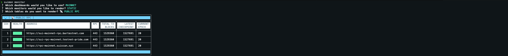
  <br><br>

- `💻 FULL NODES`
  <br><br>
  This table provides information about the full nodes, such as their addresses, port numbers, health, transactions, checkpoints, uptime, and many others. The table is designed to display detailed information that can be useful for developers and network administrators who need to monitor the full nodes.
  <br><br>
  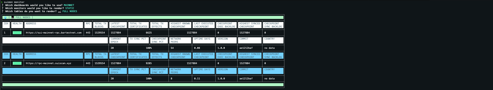
  <br><br>

- `🤖 VALIDATORS`
  <br><br>
  This table is especially useful for developers and network administrators who need to keep track of the network’s validators and ensure that they are functioning correctly. By using the information provided in the table, developers and administrators can quickly identify any issues with the validators and take the necessary steps to resolve them.
  <br><br>
  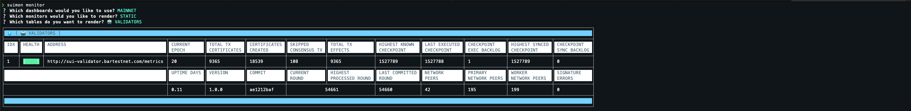
  <br><br>

- `💰 EPOCH, GAS AND SUBSIDY`
  <br><br>
  This table is a valuable resource for obtaining metrics about the current epoch, reference gas prices, and subsidies in a network. This table provides information about the current epoch, such as its number, start, and end time, and total duration. The table also provides information about the reference gas price and subsidies, such as their current values and estimated values for the next epoch.
  <br><br>
  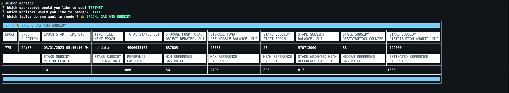
  <br><br>

- `⏳ EPOCHS HISTORY`
  <br><br>
  This table provides information about the last 100 epochs.  The table is designed to display detailed information that can be useful for developers and network administrators for the monitoring of historical data.
  <br><br>
  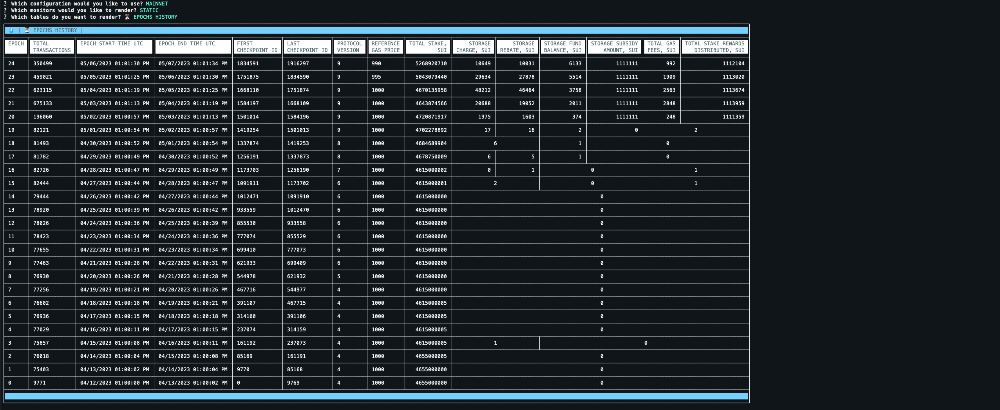
  <br><br>

- `📊 VALIDATORS PARAMS`
  <br><br>
  This table provides information about network thresholds and parameters for validators. This table provides information about the number of validators in various states, such as active, pending, and at risk, as well as the minimum stake threshold required for validation, and other system-wide metrics.
  <br><br>
  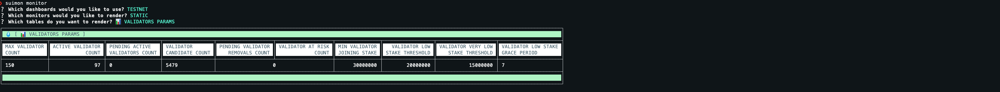
  <br><br>

- `📢 VALIDATORS REPORTS`
  <br><br>
  The table provides information about the latest reports submitted by validators, which can influence tallying rule decisions. This table provides a quick and easy way to monitor the latest reports submitted by validators and identify any that may have an impact on the network.
  <br><br>
  
  <br><br>

- `✅ ACTIVE VALIDATORS`
  <br><br>
  This table provides valuable information about the current list of active validators on the network. This table displays important metrics such as APY, stake, commission, rewards, and other relevant information that can help network administrators monitor the performance of active validators.
  <br><br>
  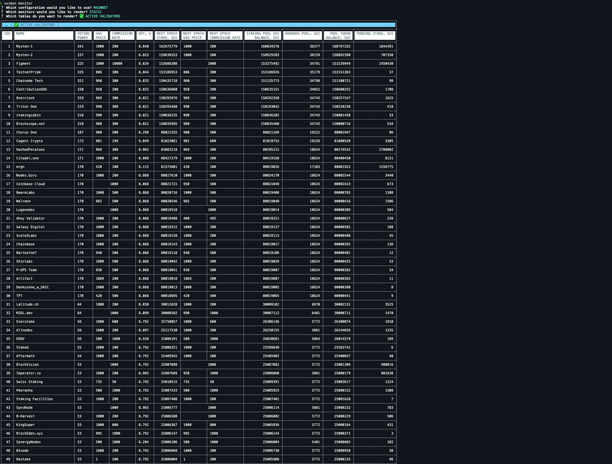

## Dashboards

Dashboards are dynamic monitors that provide real-time information about the network and its entities. Unlike static tables, which provide a snapshot of the network at a specific point in time, dashboards continuously update and display data in real-time.

| Dashboard Type            | Description                                                        |
| ------------------------- | ------------------------------------------------------------------ |
| 📡 PUBLIC RPC             | Displays detailed information about the network's RPC endpoints.   |
| 💻 FULL NODES             | Displays detailed information about the network's nodes.           |
| 🤖 VALIDATORS             | Displays detailed information about the network's validators.      |
| 💰 EPOCH, GAS AND SUBSIDY | Displays the current gas price and subsidy values for the network. |

### Dashboard Examples

- `📡 PUBLIC RPC`
  <br><br>
  The table is a valuable resource for obtaining detailed information about a network’s RPC (Remote Procedure Call) endpoints. This table provides detailed information about the network’s RPC endpoints, such as their addresses, port numbers, health, total transaction blocks, latest checkpoints, and other ones.
  <br><br>
  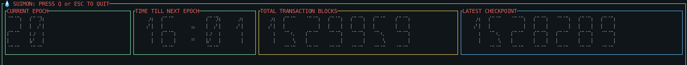
  <br><br>

- `💻 FULL NODES`
  <br><br>
  This table provides information about the full nodes, such as their addresses, port numbers, health, transactions, checkpoints, uptime, and many others. The table is designed to display detailed information that can be useful for developers and network administrators who need to monitor the full nodes.
  <br><br>
  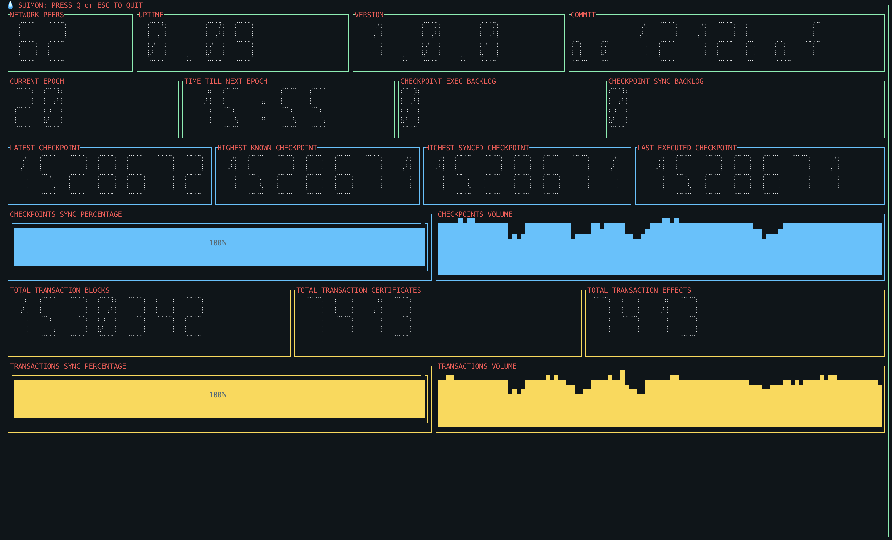
  <br><br>

- `🤖 VALIDATORS`
  <br><br>
  This table is especially useful for developers and network administrators who need to keep track of the network’s validators and ensure that they are functioning correctly. By using the information provided in the table, developers and administrators can quickly identify any issues with the validators and take the necessary steps to resolve them.
  <br><br>
  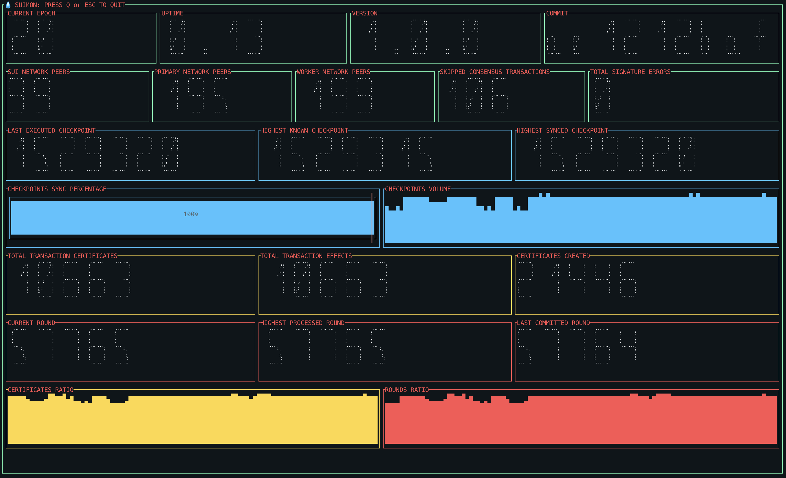
  <br><br>

- `💰 EPOCH, GAS AND SUBSIDY`
  <br><br>
  This table is a valuable resource for obtaining metrics about the current epoch, reference gas prices, and subsidies in a network. This table provides information about the current epoch, such as its number, start, and end time, and total duration. The table also provides information about the reference gas price and subsidies, such as their current values and estimated values for the next epoch.
  <br><br>
  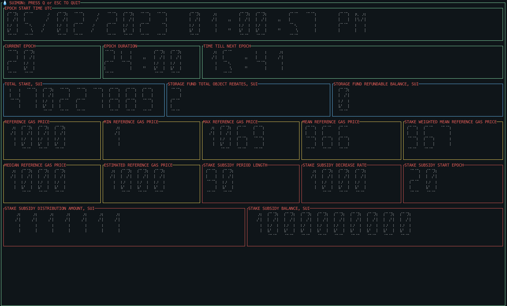
  <br><br>

## License

This project is licensed under the [MIT License](LICENSE). You are free to use, modify, and distribute this code, as long as you give credit to the original source.

# Acknowledgments

This project is based on the work of [bartosian](https://github.com/bartosian). If you use this code, please give credit to the original source.
