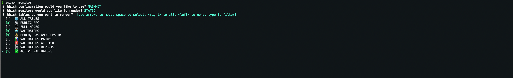

# SUIMON: Command Line Tool for Monitoring SUI Network

<p align="center">
  
</p>

``Suimon`` is a powerful command line tool designed to provide detailed dashboards for monitoring the SUI network. With Suimon, you can easily monitor the health and performance of your nodes and validators, as well as track important system states and events in real-time.

Whether you're a network operator, validator, or simply a curious observer, Suimon offers a range of powerful monitoring capabilities that can help you stay on top of the SUI network. From node status and uptime monitoring, to detailed performance metrics and system state tracking, Suimon provides everything you need to ensure your network is running smoothly and efficiently.

So if you're looking for a powerful, reliable tool for monitoring the SUI network, look no further than Suimon. Try it out today and start monitoring your network with confidence!

## Installation

The scripts directory contains installation scripts for several common environments, including Ubuntu, Mac OS, and Windows. These scripts are provided for convenience only and do not provide any guarantees that Suimon will run without issues on your system.

### Ubuntu

```shell
wget -O $HOME/suimon_install.sh https://raw.githubusercontent.com/bartosian/suimon/main/scripts/ubuntu/install.sh && \
chmod +x $HOME/suimon_install.sh && \
$HOME/suimon_install.sh && \
rm $HOME/suimon_install.sh
```

### MacOS

```shell
curl -o $HOME/suimon_install.sh https://raw.githubusercontent.com/bartosian/suimon/main/scripts/macos/install.sh && \
chmod +x $HOME/suimon_install.sh && \
$HOME/suimon_install.sh && \
rm $HOME/suimon_install.sh
```

### Windows

```shell
Invoke-WebRequest -OutFile $HOME\suimon_install.ps1 https://raw.githubusercontent.com/bartosian/suimon/main/scripts/windows/install.ps1 ; \
powershell -ExecutionPolicy Bypass -File $HOME\suimon_install.ps1 ; \
Remove-Item $HOME\suimon_install.ps1
```

## Build and Installation from Source

1. **Install Go**
    * The Suimon installation requires Go. If you don't already have Go installed, please visit [https://golang.org/dl](https://golang.org/dl) and [https://go.dev/doc/install](https://go.dev/doc/install) for instructions on how to download and install Go on your system. Download the binary release that is suitable for your system and follow the installation instructions.

2. **Clone the Suimon repository**
    * Clone the Suimon repository by running the following command in your terminal:
      ```
      cd $HOME && \
      git clone https://github.com/bartosian/suimon.git && \
      cd suimon
      ```

3. **Install packages and dependencies**
    * Install packages and dependencies required by the Suimon tool by running the following command:
      ```
      go get -u ./...
      ```

4. **Build the Suimon package**
    * Build the Suimon package by running the following command:
      ```
      go build -o suimon .
      ```

5. **Move the built binary to the executable PATH**
    * Move the `suimon` binary to a directory that's listed in your executable PATH to make it easy to run the Suimon tool from anywhere in your terminal. You can find the list of directories in your executable PATH by running the following command in your terminal:
      ```
      echo $PATH
      ```
    * For example, if the output of the `echo $PATH` command includes `/usr/local/bin`, you can move the `suimon` binary to this directory by running the following command:
      ```
      mv suimon /usr/local/bin/
      ```
    * If you're not sure which directory to use, you can create a new directory in your home directory called `bin` by running the following command:
      ```
      mkdir $HOME/bin
      ```
      Then, add the `bin` directory to your executable PATH by adding the following line to your shell configuration file (e.g. `~/.bashrc` for Bash or `~/.zshrc` for Zsh):
      ```
      export PATH=$PATH:$HOME/bin
      ```
      Finally, move the `suimon` binary to the `bin` directory by running the following command:
      ```
      mv suimon $HOME/bin/
      ``` 
6. **Create a Suimon config directory and put config file there**
   * Create a directory for your Suimon config files by running the following command:
     ```
     mkdir $HOME/.suimon && \
     cp $HOME/suimon/main/static/suimon.template.yaml $HOME/.suimon/suimon-testnet.yaml
     ```
   * For each network that you want to connect to, create a separate YAML file with the naming convention `suimon-<network>.yaml` and put it in the `.suimon` directory. For example, if you want to connect to the mainnet, you can create a file called `suimon-mainnet.yaml` and put it in the `.suimon` directory.

## Suimon Config Files

``Suimon`` uses configuration files to manage settings and defaults for different environments and networks. The default configuration file for the Suimon tool is suimon-testnet.yaml, which is located in the ~/.suimon directory. However, you can use multiple configuration files to manage settings for different networks and environments.

By properly configuring your Suimon configuration file, you can reduce the need for command-line interface (CLI) flags when running the tool. The configuration file can contain default values and settings that are automatically applied to the tool when it is executed. This can streamline your workflow and reduce the amount of time and effort required to run the tool.

You can also provide a different location for the configuration files by using the ``SUIMON_CONFIG_PATH`` environment variable to the desired configuration directory path. This allows you to customize the location of the configuration files to your needs, such as if you want to store it in a specific directory or share it with others in a different location.

To manage settings for different networks and environments, create separate configuration files with the naming convention `suimon-<network>.yaml` and put them in the ~/.suimon directory. For example, if you want to connect to the mainnet, you can create a file called `suimon-mainnet.yaml` and put it in the `.suimon` directory.

Sure, here's an updated version with a header that clarifies that the file prefixes are up to the user and the following is just an example of files in the ~/.suimon directory:

### Example Suimon Config Directory

The names for these configuration files is up to the user. In this example, we've used the naming convention `suimon-<network>.yaml` to provide an example of how to name configuration files for different networks.

Here is an example file tree for the `~/.suimon` directory:

```
~/.suimon
├── suimon-testnet.yaml
├── suimon-devnet.yaml
└── suimon-mainnet.yaml
```

### Suimon Configuration Fields

```yaml
# This section lists the public RPC endpoints that the client will use to monitor the network and calculate the health of the nodes and validators.
# Please make sure to provide at least one working endpoint.
public-rpc:
   - "https://wave3-rpc.testnet.sui.io:443"
   - "https://rpc-ws-testnet-w3.suiprovider.xyz:443"
   - "https://sui-api.rpc.com:443"

# if you wish to monitor the node, update this section with the node information
full-nodes:
   - json-rpc-address: 0.0.0.0:9000
     metrics-address: 0.0.0.0:9184
   - json-rpc-address: https://sui-rpc.testnet.com
     metrics-address: https://sui-rpc.testnet.com/metrics

# if you wish to monitor the validator, update this section with the validator information
validators:
   - metrics-address: 0.0.0.0:9184/metrics
   - metrics-address: https://sui-validator.testnet.com:9184/metrics
   - metrics-address: https://sui-validator.mainnet.com:9184/metrics

# if you wish to monitor peers, update this section with the peers information
seed-peers:
   - "/ip4/178.18.250.62/udp/8080"
   - "/ip4/213.239.215.119/udp/8084"
   - "/ip4/65.109.32.171/udp/8084"

# provider and country information in tables is requested from https://ipinfo.io/ public API. To use it, you need to obtain an access token on the website,
# which is free and gives you 50k requests per month, which is sufficient for individual usage.
ip-lookup:
   access-token: "55f30ce0213aa7" # temporary access token with requests limit
```

The `public-rpc` field is required to request system metrics and to calculate the health of nodes and validators. The other fields are optional and can be updated if needed.

#### Public RPC Endpoints
The `public-rpc` section This section lists the public RPC endpoints that the client will use to monitor the network and calculate the health of the nodes and validators. Therefore, it is essential to provide accurate and up-to-date endpoint information in this section.

Examples:
- https://wave3-rpc.testnet.sui.io:443
- https://rpc-ws-testnet-w3.suiprovider.xyz:443
- https://sui-api.rpc.com:443

#### Full Nodes
The `full-nodes` section lists the full nodes available for monitoring the SUI Testnet. The user can update this section with information for any number of nodes, following the example format provided. It is important to note that the RPC address is required to be provided for each node, while the metrics address is optional.

Examples:
- json-rpc-address: 0.0.0.0:9000 
  metrics-address: 0.0.0.0:9184
- json-rpc-address: https://sui-rpc.testnet.com  
  metrics-address: https://sui-rpc.testnet.com/metrics

#### Validators
The `validators` section lists the validators to monitor. The user can update this section with information for any number of validators, following the example format provided. It is important to note that only the metrics endpoint is required to be provided for each validator.

Examples:
- metrics-address: 0.0.0.0:9184/metrics
- metrics-address: https://sui-validator.testnet.com:9184/metrics
- metrics-address: https://sui-validator.mainnet.com:9184/metrics

#### Seed Peers
The `seed-peers` section lists the seed peers available for monitoring the SUI Testnet. The user can update this section with information for any number of seed peers, following the example format provided. It is important to note that the address for each seed peer must be provided in a valid peer format, as demonstrated in the examples.

Examples:
- /ip4/178.18.250.62/udp/8080
- /ip4/213.239.215.119/udp/8084
- /ip4/65.109.32.171/udp/8084

#### IP Lookup
The `ip-lookup` section provides information on how to use the `ipinfo.io` public API to get provider and country information in tables. The user needs to obtain an access token on the website to use this feature. The current access token provided is temporary with a limited number of requests per month.

## Suimon Commands

The Suimon tool provides several commands that can be used to interact with the SUI blockchain. Here is an overview of the main commands:

- `suimon help`: Show help information about any command.
  
  <br><br>

- `suimon monitor`: Monitor the running network with the Suimon monitoring tool.
  <br><br>
  When you run the command, the monitoring tool will start and display a list of available configurations that have been added to the ``.suimon`` directory. Each item in the list corresponds to a configuration file, and you can select the configuration you want to use following instructions in the terminal.
  For example, if you have two configuration files in your .suimon directory named ``suimon-testnet.yaml`` and ``suimon-mainnet.yaml``, the tool will display a list like this:
  <br><br>
  
  <br><br>
  After selecting a configuration file to use with the suimon monitor command, you will be presented with another list of options to select the monitor type you want to use. There are two monitor types available: ``static`` and ``dynamic``.

  The ``static`` monitor type displays tables that show detailed information about the network, such as block and transaction data, validator information, and network statistics. This type of monitor is useful for analyzing the network and getting a detailed view of its operations.

  The ``dynamic`` monitor type displays real-time dashboards that show key metrics about the network. This type of monitor is useful for getting a quick overview of the network's current state and performance.
  <br><br>
  
  <br><br>
  This will prompt you to select a table to render.
  <br><br>
  
  <br><br>

- `suimon version`: Show version information for the Suimon monitoring tool.
  

## Tables

Tables are static monitors that provide a detailed snapshot of the network and its entities at a certain point in time.

| Table Type                | Description                                                                    |
|---------------------------|--------------------------------------------------------------------------------|
| 📡 PUBLIC RPC             | Displays detailed information about the network's RPC endpoints.               |
| 💻 FULL NODES             | Displays detailed information about the network's nodes.                       |
| 🤖 VALIDATORS             | Displays detailed information about the network's validators.                  |
| 🤝 PEERS                  | Displays detailed information about the network's peers.                       |
| 💰 EPOCH, GAS AND SUBSIDY | Displays the current gas price and subsidy values for the network.             |
| 📊 VALIDATORS PARAMS      | Displays the validators related thresholds and counts on the network.          |
| 🚨 VALIDATORS AT RISK     | Displays the number of validators that are currently at risk of being slashed. |
| 📢 VALIDATORS REPORTS     | Displays the latest reports submitted by validators.                           |
| ✅ ACTIVE VALIDATORS      |  Displays the current list of active validators on the network.                |

### Table Examples

- `💰 EPOCH, GAS AND SUBSIDY`
  <br><br>
  
  <br><br>

- `📊 VALIDATORS PARAMS`
  <br><br>
  
  <br><br>

- `📡 PUBLIC RPC`
  <br><br>
  
  <br><br>

- `🤖 VALIDATORS`
  <br><br>
  
  <br><br>

- `💻 FULL NODES`
  <br><br>
  
  <br><br>

- `📢 VALIDATORS REPORTS`
  <br><br>
  

## Dashboards

Dashboards are dynamic monitors that provide real-time information about the network and its entities. Unlike static tables, which provide a snapshot of the network at a specific point in time, dashboards continuously update and display data in real-time.

| Dashboard Type            | Description                                                                    |
|---------------------------|--------------------------------------------------------------------------------|
| 📡 PUBLIC RPC             | Displays detailed information about the network's RPC endpoints.               |
| 💻 FULL NODES             | Displays detailed information about the network's nodes.                       |
| 🤖 VALIDATORS             | Displays detailed information about the network's validators.                  |
| 💰 EPOCH, GAS AND SUBSIDY | Displays the current gas price and subsidy values for the network.             |

### Dashboard Examples

- `📡 PUBLIC RPC`
  <br><br>
  
  <br><br>

- `💻 FULL NODES`
  <br><br>
  
  <br><br>

- `🤖 VALIDATORS`
  <br><br>
  
  <br><br>

- `💰 EPOCH, GAS AND SUBSIDY`
  <br><br>
  

# License

This project is licensed under the Apache 2.0 License - see the [LICENSE](LICENSE) file for details.