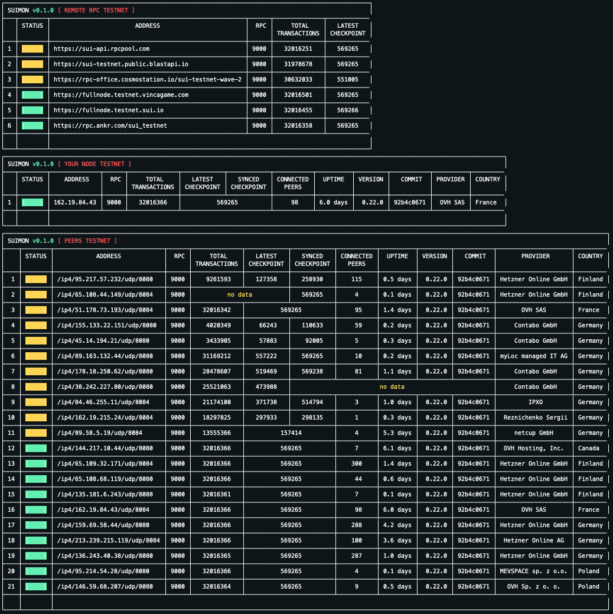
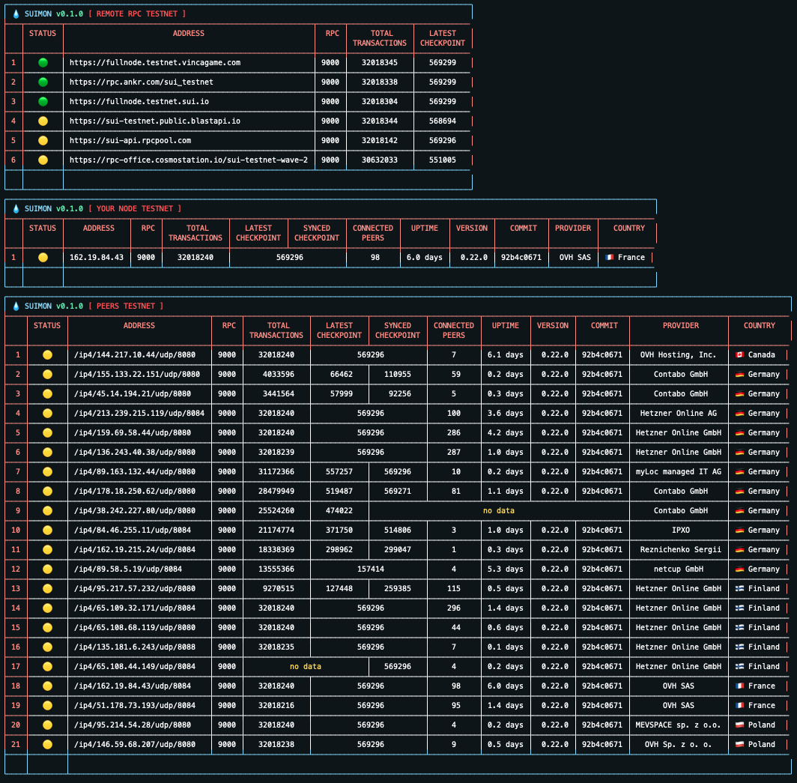
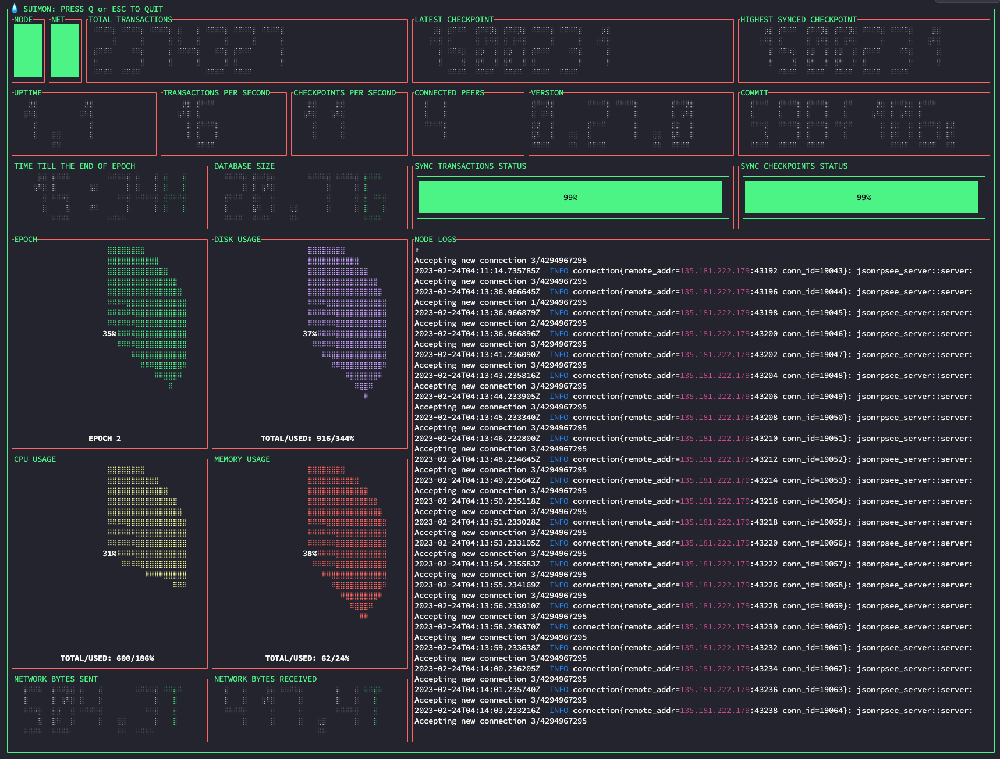

## 💧 SUIMON In-Terminal SUI Monitor

<div style="width:500px; margin:auto;">
  
</div>

``SUIMON`` is an in-terminal tool designed to provide dashboard for monitoring SUI node and the network. It enables users to monitor real-time performance metrics, such as CPU usage, memory usage, network traffic, checkpoints, transactions, uptime, network status, peers, remote RPC, and more. ``SUIMON`` is a user-friendly tool that can be easily installed and configured using a YAML configuration file. The tool provides different dashboards to monitor various aspects of the SUI node and network, such as the node's CPU and memory usage, network latency, and the number of active connections to the network. With its user-friendly interface and real-time performance monitoring capabilities, ``SUIMON`` is a valuable tool for SUI node operators and network administrators.

## Install SUIMON

### Installation Script For Ubuntu:

The ``install.sh`` script automates the installation and setup of the ``SUIMON`` tool. The purpose of the script is to simplify the installation process by automatically installing necessary dependencies. Once the installation is complete, the user can access the Suimon dashboard in terminal and start monitoring their node's performance metrics in real-time.

```shell
wget -O $HOME/suimon_install.sh https://raw.githubusercontent.com/bartosian/sui_helpers/main/suimon/install.sh && \
chmod +x $HOME/suimon_install.sh && \
$HOME/suimon_install.sh && \
rm $HOME/suimon_install.sh
```

### Step by Step Installation:

In the event that the ``install.sh`` installation script fails to install the ``SUIMON`` tool, there is a step-by-step guide that users can follow to set up the tool manually. This guide consists of several steps and is designed to help users troubleshoot any issues that may have occurred during the automated installation process.

1. The SUIMON installation ``requires Go``. If you don't already have Go installed, see https://golang.org/dl and https://go.dev/doc/install. Download the binary release that is suitable for your system and follow the installation instructions.

2. Clone the ``sui_helpers`` repository by running the following command:
```shell
cd $HOME && \
git clone https://github.com/bartosian/sui_helpers.git
```

3. Once the repository is cloned, navigate to the ``suimon`` folder by running the following command:
```shell
cd sui_helpers/suimon
```

4. Install packages and dependencies required by the ``SUIMON`` tool:
```shell
go get -u ./...
```

5. Build the ``SUIMON`` package by running the following command:
```shell
go build -o suimon .
```

This command will create a binary file named suimon in the current directory.

6. Move the binary file to the Go executables PATH by running the following command:
```shell
sudo mv suimon /usr/local/go/bin/
```

This command will move the suimon binary to the Go executables PATH, which is typically located in /usr/local/go/bin/.
After completing these steps, you should be able to run the suimon command from anywhere in the terminal. Note that the sudo command may prompt you for your password in order to move the binary file to the /usr/local/go/bin/ directory.

7. Create ``SUIMON`` config directory and put ``suimon.yaml`` file there:
```shell
mkdir $HOME/.suimon && \
cp $HOME/sui_helpers/suimon/cmd/checker/config/suimon.template.yaml $HOME/.suimon
```

``suimon.yaml`` is a configuration file used by the ``SUIMON`` tool. If this file is properly configured, it can eliminate the need to use command-line interface (CLI) flags when using the tool. This is because the configuration file can contain default values and settings that are automatically applied to the tool when it is executed. By using a configuration file, users can streamline their workflow and reduce the amount of time and effort required to run the tool.
The default location for the SUIMON tool's configuration file, suimon.yaml, is in the ``~/.suimon`` directory. However, if needed, users can provide a different location for the configuration file by using the command-line interface (CLI) flag ``-s`` followed by the path to the desired location, or by setting the ``SUIMON_CONFIG_PATH`` environment variable to the desired file path. This allows users to customize the location of the configuration file to their needs, such as if they want to store it in a specific directory or share it with others in a different location.

### Example suimon.yaml:
```yaml
# update this section if you want to enable/disable tables
monitors-config:
  rpc-table:
    display: true
  node-table:
    display: true
  peers-table:
    display: true

# update this section to add/remove rpc hosts for rpc-table
rpc-config:
  testnet:
    - "https://rpc-office.cosmostation.io/sui-testnet-wave-2"
    - "https://rpc.ankr.com/sui_testnet"
    - "https://sui-api.rpcpool.com"
    - "https://sui-testnet.public.blastapi.io"
    - "https://fullnode.testnet.vincagame.com"
    - "https://fullnode.testnet.sui.io"
  devnet:
    - "https://fullnode.devnet.sui.io"

# update this value to the fullnode.yaml file location
node-config-path: "/root/.suimon/fullnode.yaml"

# set network to connect to. Possible values: devnet, testnet
network: "testnet"

# provider and country information in tables is requested from https://ipinfo.io/ public API. To use it, you need to obtain an access token on the website,
# which is free and gives you 50k requests per month, which is sufficient for individual usage.
ip-lookup:
  access-token: "<token value>" # temporary access token with requests limit

monitors-visual:
  # set different color schemes for monitor depending on your terminal. Possible values: dark, white, color
  color-scheme: "white"

  # update this section if you want to enable/disable emojis in tables
  enable-emojis: false
```

8. Provide path to ``fullnode.yaml`` config file your node is using. To specify the path to the ``fullnode.yaml`` configuration file for your node in the ``SUIMON`` tool, there are several options available. You may choose to specify the ``node-config-path`` attribute within the ``suimon.yaml`` configuration file, use the ``-f`` flag followed by the path to the file in the command line, or set the ``SUIMON_NODE_CONFIG_PATH`` environment variable to the path of the file.
You can also use the following command for it:
```bash
result=$(find / -name "$config_file_name" 2>/dev/null)
if [ -z "$result" ]; then
  echo "File not found."
elif [ $(echo "$result" | wc -l) -eq 1 ]; then
  sed -i -e "s%node-config-path:.*%node-config-path: \"$result\"%;" $HOME/.suimon/suimon.yaml
else
  echo "Multiple instances of the $config_file_name found: $result. Please specify path to one of them by using '-nf' flag or 'SUIMON_NODE_CONFIG_PATH' env variable."

  exit 1
fi
```

The ``fullnode.yaml`` file is a configuration file used to specify the various settings and options for a SUI Node. It contains settings related to the node's network and database configurations, as well as other options like logging and security settings. Some of the key configuration options available in this file include the network name, the node's peer-to-peer communication settings, the database backend to use, the node's storage settings, the logging configuration, and more.
For more detailed information about setting up a SUI node and configuring the ``fullnode.yaml`` configuration file, users can refer to the official SUI documentation available at https://docs.sui.io/build/fullnode. This documentation provides detailed instructions and guidance on how to set up a SUI node and configure its various parameters, including the fullnode.yaml configuration file. By following the guidelines provided in the official documentation, users can ensure that their SUI node is set up correctly and operates optimally.

9. You can run the ``suimon`` command from anywhere in the terminal, and it should start up the tool with the default configuration. However, if you encounter any issues or want to customize the behavior of the ``SUIMON`` tool, you can edit the ``suimon.yaml`` file to change the configuration settings.

## Run SUIMON

#### Launch SUIMON:

If you have set path to fullnode.yaml file in suimon

```shell
suimon
```

#### Launch SUIMON and provide suinode.yaml path: 

``-s`` flag is used to specify the path to a custom ``suimon.yaml`` configuration file, but it should only be used if you've created the file in a directory other than the default ``$HOME/.suimon/`` directory.

```shell
suimon -s suinode.yaml
```

#### Launch SUIMON and provide fullnode.yaml path:

``-f`` flag is used to specify the path to the ``fullnode.yaml`` configuration file, but it should only be used if you haven't set the ``node-config-path`` field in your ``suimon.yaml`` configuration file.

```shell
suimon -f fullnode.yaml
```

#### Launch SUIMON and provide network name:

by default ``SUIMON`` will use the network name specified in the ``network`` field of ``suimon.yaml`` file.

```shell
suimon -n devnet
```

#### Launch SUIMON in watching mode:

enables a dynamic dashboard to monitor node and system metrics in real-time

```shell
suimon -w
```

## Update SUIMON

If ``suimon`` package was installed using the command ``go install``, it can be updated to the latest version on the main branch by running the following command:
```shell
go install github.com/bartosian/sui_helpers/suimon@main
```

If you have cloned the ``suimon`` repository, you can update it to the latest version on the main branch by pulling the latest updates from the remote repository, rebuilding the Go binary, and replacing the existing binary in the executables directory.

```shell
cd $HOME/sui_helpers && \
git pull origin main && \
cd suimon && \
go build -o suimon . && \
sudo mv suimon /usr/local/go/bin/
```

if you have cloned 

## Flags

The ``SUIMON`` command-line tool provides several optional flags that can be used to customize its behavior. When the suimon command is executed with the ``--help`` flag, a list of available flags is displayed. The following is a description of the available flags:

```shell
suimon --help

Usage of suimon:
  -f string
    	(optional) path to the node config file, can use SUIMON_NODE_CONFIG_PATH variable instead
  -n string
    	(optional) network name, possible values: testnet, devnet
  -s string
    	(optional) path to the suimon config file, can use SUIMON_CONFIG_PATH env variable instead
  -w	(optional) flag to enable a dynamic dashboard to monitor node metrics in real-time
```

| Name   | Required | Default               | Purpose                                                                                                                                                                                                                                         |
|--------|----------|-----------------------|-------------------------------------------------------------------------------------------------------------------------------------------------------------------------------------------------------------------------------------------------|
| ``-s`` | false    | path to suinode.yaml  | flag that allows the user to specify the custom path to the node configuration file ``suimon.yaml``. If this flag is not provided, the ``SUIMON_CONFIG_PATH`` environment variable can be used instead.                                         |
| ``-f`` | false    | path to fullnode.yaml | flag that allows the user to specify the path to the node configuration file ``fullnode.yaml``. If this flag is not provided, the ``SUIMON_NODE_CONFIG_PATH`` environment variable or related sttribute in ``suimon.yaml`` can be used instead. |
| ``-n`` | false    | devnet                | flag that allows the user to specify the network name. Possible values: ``devnet`` ``testnet``                                                                                                                                                  |
| ``-w`` | false    | false                 | flag that enables a dynamic dashboard to monitor node and system metrics in real-time.                                                                                                                                                          |

## Config Files

| Name              | Required | Default Directory | Purpose                                        |
|-------------------|----------|-------------------|------------------------------------------------|
| ``suimon.yaml``   | true     | ~/.suimon         | configuration file used by the ``SUIMON`` tool |
| ``fullnode.yaml`` | true     | ~/.suimon         | fullnode config file                           |

## Variables

| Name                        | Required   | Purpose                                               |
|-----------------------------|------------|-------------------------------------------------------|
| ``SUIMON_CONFIG_PATH``      | false      | path to suinode config file ``suinode.yaml``          |
| ``SUIMON_NODE_CONFIG_PATH`` | false      | path to node config file ``fullnode.yaml``            |
| ``SUIMON_NETWORK``          | false      | network name. Possible values: ``devnet`` ``testnet`` |

## IP Information Lookup
``Provider`` and ``country`` information in tables is requested from https://ipinfo.io/ public API. To use it, you need to obtain an access token on the website,
which is free and gives you ``50k requests`` per month, which is sufficient for individual usage. There is a free token included in ``suimon.yaml`` file, which has the same limits and can be used by everyone.

## Preview

Depending on the emojis and colors support by your terminal you can enable/disable different color options, to make it suitable for you. Check ``monitors-visual`` in the ``suimon.yaml`` config file.

### White / Dark Mode



### Color Mode



### Watching Mode

``-w`` flag enables dynamic dashboard to monitor node and system metrics in real-time



## Run In Development

To manually run ``SUIMON`` locally for the development cases:
1. Clone the ``sui_helpers`` repository by running the following command:
```shell
cd $HOME && \
git clone https://github.com/bartosian/sui_helpers.git
```

2. Once the repository is cloned, navigate to the ``suimon`` folder by running the following command:
```shell
cd sui_helpers/suimon
```

3. Install packages and dependencies required by the ``SUIMON`` tool:
```shell
go get -u ./...
```

4. Run ``SUIMON`` by running the following command:
```shell
go run main.go
```

# License

Apache2.0
